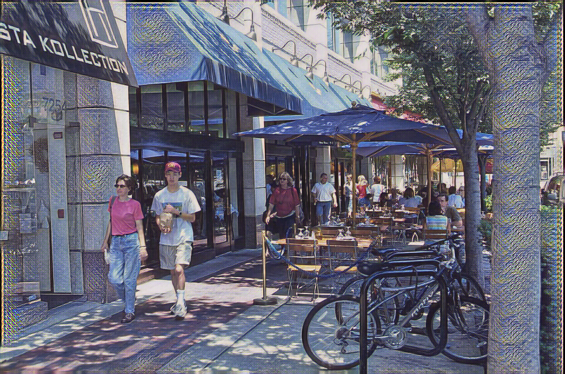
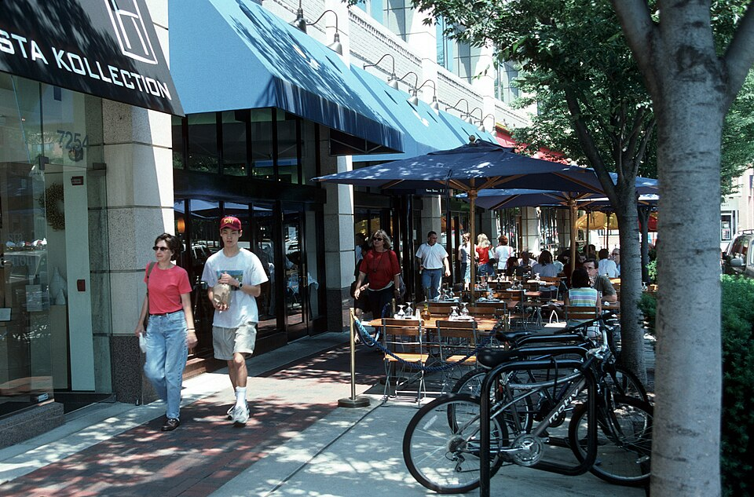
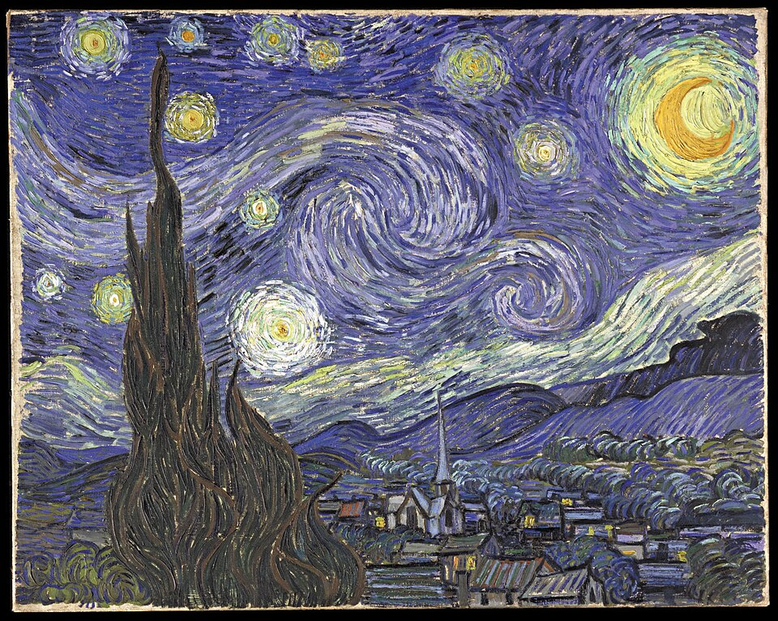
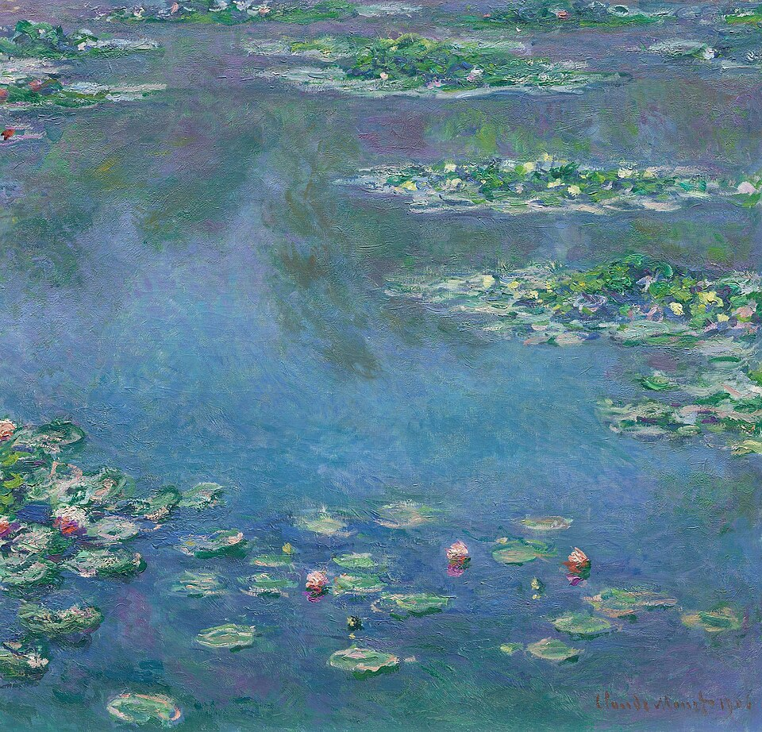

# Neural Style Transfer

基于 PyTorch 和 VGG19 的图像风格迁移实验。项目实现了两种方式：

- 经典 Neural Style Transfer：直接优化生成图像，让它同时接近内容图的结构和风格图的纹理。
- Fast Style Transfer：训练一个前向生成网络，训练完成后可以快速把任意内容图转换为指定艺术风格。

这个项目是我学习深度学习图像生成时完成的实验，重点不只是跑出一张风格化图片，而是理解 CNN 中间层特征、Gram Matrix、感知损失以及训练式图像转换模型之间的关系。



## 效果对比

| 内容图 | 风格图 | 生成结果 |
| --- | --- | --- |
|  |  |  |

项目中还准备了其他风格图，后续可以用同一张内容图继续做不同风格的对比实验。

| 星月夜 | 神奈川冲浪里 | 睡莲 |
| --- | --- | --- |
|  |  |  |

## 技术栈

- Python
- PyTorch
- torchvision
- Pillow
- NumPy
- VGG19 pretrained on ImageNet

## 项目结构

```text
.
├── run_style.py              # 经典优化式风格迁移
├── train_fast_style.py       # 训练快速风格迁移模型
├── stylize_fast.py           # 使用训练好的模型进行推理
├── libs/
│   ├── dataset.py            # 图片路径读取
│   ├── image_utils.py        # 图片加载、归一化、保存和设备选择
│   ├── style_loss.py         # Gram Matrix、内容损失、风格损失
│   ├── train_dataset.py      # 训练数据集封装
│   ├── transform_net.py      # 前向风格迁移网络
│   └── vgg_features.py       # VGG19 中间层特征提取
├── data/
│   ├── content/              # 内容图示例
│   ├── style/                # 风格图示例
│   ├── DATASETS.md           # 训练数据说明
│   └── SOURCES.md            # 示例图片来源
├── scripts/                  # 数据集下载脚本
├── assets/demo/              # README 展示图
├── outputs/                  # 生成结果，本地运行产生
└── checkpoints/              # 模型权重，本地训练产生
```

## 实现原理

### 1. 优化式 Neural Style Transfer

经典版本使用预训练 VGG19 作为固定特征提取器，不更新 VGG19 的参数，而是更新生成图像本身。

内容图像通过较高层特征表示主体结构、轮廓和空间布局；风格图像通过多个层的 Gram Matrix 表示颜色、纹理和笔触的统计关系。

总损失由内容损失和风格损失组成：

```text
L_total = alpha * L_content + beta * L_style
```

在代码中，`run_style.py` 会：

1. 读取内容图和风格图。
2. 使用 VGG19 提取指定层特征。
3. 计算内容图目标特征和风格图 Gram Matrix。
4. 初始化生成图。
5. 使用 Adam 直接优化生成图像。
6. 保存最终风格化结果。

### 2. 快速风格迁移

优化式方法效果直观，但每生成一张图都需要迭代多次。为了提升推理速度，项目中还实现了一个 `TransformerNet`。

`TransformerNet` 是一个前向图像转换网络，结构包含：

- 卷积层
- Instance Normalization
- Residual Blocks
- 上采样卷积层
- Sigmoid 输出，将图像限制在 `[0, 1]`

训练时，模型输入内容图片并输出生成图。VGG19 仍然作为感知损失网络，用来计算：

- 内容损失：保留原图结构。
- 风格损失：匹配风格图的 Gram Matrix。
- Total Variation Loss：减少噪声，让图像更平滑。

训练完成后，`stylize_fast.py` 只需要一次前向传播就能生成风格化图片。

## 快速开始

安装依赖：

```bash
pip install -r requirements.txt
```

运行经典风格迁移：

```bash
python run_style.py \
  --content data/content/city_street.jpg \
  --style data/style/starry_night.jpg \
  --out outputs/city_street_starry.png
```

如果在 PowerShell 中运行，可以写成一行：

```powershell
python run_style.py --content data/content/city_street.jpg --style data/style/starry_night.jpg --out outputs/city_street_starry.png
```

## 训练快速风格迁移模型

下载 COCO val2017 作为内容图训练集：

```powershell
powershell -ExecutionPolicy Bypass -File scripts/download_coco.ps1 -Split val2017
```

训练一个小模型：

```powershell
python train_fast_style.py --content-dir data/train/content/val2017 --style data/style/starry_night.jpg --epochs 2 --batch-size 4 --image-size 256
```

调试时可以限制图片数量：

```powershell
python train_fast_style.py --content-dir data/train/content/val2017 --style data/style/starry_night.jpg --epochs 1 --batch-size 2 --limit-images 16 --sample-interval 2 --log-interval 1
```

使用训练好的 checkpoint 推理：

```powershell
python stylize_fast.py --input data/content/city_street.jpg --checkpoint checkpoints/fast_style_epoch_2.pth --out outputs/fast_city_starry.png
```

## 常用参数

经典风格迁移：

```text
--image-size       输入图统一尺寸，默认 384
--steps            优化步数，默认 300
--content-weight   内容损失权重，默认 1.0
--style-weight     风格损失权重，默认 500000
--content-layer    内容层，默认 relu4_2
--style-layers     风格层，默认 relu1_1 relu2_1 relu3_1 relu4_1 relu5_1
--init             初始图像，可选 content 或 noise
```

快速风格迁移训练：

```text
--content-weight   内容损失权重
--style-weight     风格损失权重
--tv-weight        平滑损失权重
--batch-size       批大小
--epochs           训练轮数
--limit-images     调试时限制训练图片数量
```

## 实验观察

在实验中，`style_weight` 对结果影响非常明显。权重过小时，输出图更像原图，只出现轻微色彩变化；权重过大时，艺术纹理更强，但人物、建筑边缘和细节可能会变形。

`style_layers` 也会改变迁移效果。浅层更容易带来颜色、边缘和局部纹理；深层会影响更大尺度的图案和结构。把多层风格特征结合起来，结果会比只使用单层更稳定。

训练快速风格迁移时，我发现它和经典方法的取舍很清楚：经典方法灵活，可以随时换内容图和风格图，但每张图都要优化；快速方法需要先训练一个风格模型，但推理速度快，更适合批量处理图片。

## 项目目前的不足

这个项目目前还只是一个学习和实验性质的作品，离真正好用的图像处理软件还有一些距离。

1. 经典风格迁移的运行速度比较慢。每生成一张图片都需要反复迭代，如果图片尺寸调大，等待时间会明显变长，对电脑性能也有一定要求。

2. 生成效果不是每次都很稳定。不同内容图、不同风格图、不同参数组合都会影响结果，有时候风格不明显，有时候又会让图片细节变形比较严重。目前主要还是靠手动调整参数来尝试，没有做到自动选择比较合适的配置。

3. 快速风格迁移的灵活性不够高。虽然它的推理速度快，但一个训练好的模型基本只对应一种风格。如果想换成另一种风格，还需要重新训练新的 checkpoint。

4. 项目还没有图形界面，主要通过命令行运行。对于不熟悉命令行的用户来说，使用门槛会高一些。

5. 训练过程中的结果评价比较主观。目前主要是通过肉眼观察生成图片，没有做更完整的效果对比。

## 后续可能的开发方向

后面如果继续完善，可以先从比较实际的小功能做起。

1. 增加简单的图形界面。用户可以直接选择内容图、风格图和输出位置，不需要每次手动输入命令。这样项目会更像一个可以直接使用的小工具。

2. 整理更多常用风格的预训练模型，比如油画、素描、水彩、星空等。这样用户可以直接选择风格，而不是每次都重新训练。

3. 改进结果展示方式。可以自动保存内容图、风格图和生成图的对比图，也可以记录不同参数下的结果，方便观察哪些设置效果更好。

4. 继续优化训练和推理流程，比如支持批量处理多张图片、自动检测 GPU、减少显存占用，并给出更清楚的报错提示。

5. 尝试加入更多可调节功能。如果能力和时间允许，可以让一个模型支持多种风格，或者加入风格强度调节功能。这样用户就可以控制“像原图多一点”还是“艺术风格强一点”，使用体验会更好。

## 我学到了什么

通过这个项目，我对 CNN 的理解从“分类模型”扩展到了“通用特征提取器”。VGG19 的中间层不只可以帮助判断图片类别，也可以描述图像的结构、纹理和风格。

我也理解了 Gram Matrix 为什么能表达风格。它统计的是不同特征通道之间的相关性，不关心纹理具体出现在图片的哪个位置，因此适合表示颜色搭配、笔触方向和局部纹理这种整体视觉风格。

另外，我第一次比较完整地走了一遍图像生成项目的工程流程：图片预处理、ImageNet 归一化、特征层选择、损失函数设计、训练日志、checkpoint 保存、生成结果评估和超参数调节。这个过程让我意识到，深度学习项目的效果不只来自模型结构，还来自数据、损失函数和实验参数的共同配合。

## 数据与模型说明

仓库中只保留轻量示例图片和代码。COCO 数据集、VGG19 缓存权重、训练 checkpoint 和批量输出图片不会提交到 GitHub。

如果无法联网下载 VGG19 权重，可以将本地权重放到 `models/` 下，并使用：

```powershell
python run_style.py --vgg-weights models/vgg19.pth
```

示例图片来源见 [data/SOURCES.md](data/SOURCES.md)，训练数据建议见 [data/DATASETS.md](data/DATASETS.md)。

## 参考资料

- [A Neural Algorithm of Artistic Style](https://arxiv.org/abs/1508.06576)
- [Perceptual Losses for Real-Time Style Transfer and Super-Resolution](https://arxiv.org/abs/1603.08155)
- [Very Deep Convolutional Networks for Large-Scale Image Recognition](https://arxiv.org/abs/1409.1556)
- [PyTorch torchvision VGG19](https://docs.pytorch.org/vision/stable/models/generated/torchvision.models.vgg19.html)
- [MS COCO Dataset](https://cocodataset.org/#download)
